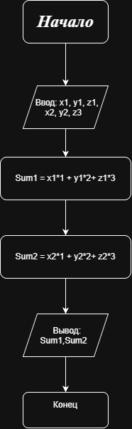

# Домашнее задание к работе 2

## Условие задачи

Фруктовый магазин продает яблоки поштучно по 1 руб., груши — по 2 руб., апельсины — по 3 руб. Известно, что в понедельник продано x яблок, y груш и z апельсинов, во вторник — также x яблок, y груш и z апельсинов. Напишите программу, которая вычисляет, какую сумму магазин продал фруктов в каждый из этих дней.

## 1. Алгоритм и блок-схема

### Алгоритм решения

1. **Начало**

2. Задать цены на фрукты:
   - `price_apple = 1` — цена яблока;
   - `price_pear = 2` — цена груши;
   - `price_orange = 3` — цена апельсина.

3. Задать количество проданных фруктов за понедельник:
   - `x1` — количество яблок;
   - `y1` — количество груш;
   - `z1` — количество апельсинов.

4. Задать количество проданных фруктов за вторник:
   - `x2` — количество яблок;
   - `y2` — количество груш;
   - `z2` — количество апельсинов.

5. Вычислить выручку за понедельник:
   - `sum1 = x1 * price_apple + y1 * price_pear + z1 * price_orange`

6. Вычислить выручку за вторник:
   - `sum2 = x2 * price_apple + y2 * price_pear + z2 * price_orange`

7. Вывести значения `sum1` и `sum2`.

8. **Конец**

### Блок-схема



[Ссылка на блок-схему, созданную в draw.io](https://drive.google.com/file/d/1jv0VcnC_l2X_56uLTi4nSEGq_IZerQVV/view?usp=drive_link)

## 2. Реализация программы

```c
#include <stdio.h>

int main()
{
    // Цены на фрукты
    const int price_apple = 1;
    const int price_pear = 2;
    const int price_orange = 3;

    // Определение значений для понедельника
    int x1 = 10; // яблоки (понедельник)
    int y1 = 5;  // груши (понедельник)
    int z1 = 8;  // апельсины (понедельник)

    // Определение значений для вторника
    int x2 = 12; // яблоки (вторник)
    int y2 = 7;  // груши (вторник)
    int z2 = 4;  // апельсины (вторник)

    // Вычисление выручки за каждый день
    int sum1 = (x1 * price_apple) + (y1 * price_pear) + (z1 * price_orange);
    int sum2 = (x2 * price_apple) + (y2 * price_pear) + (z2 * price_orange);

    // Вывод результатов
    printf("Выручка за понедельник: %d руб.\n", sum1);
    printf("Выручка за вторник: %d руб.\n", sum2);

    return 0;
}
```

## 3. Результаты работы программы

```text
Выручка за понедельник: 44 руб.
Выручка за вторник: 38 руб.
```

## 4. Информация о разработчике

Петров Егор Андреевич, БИЦТ-262
